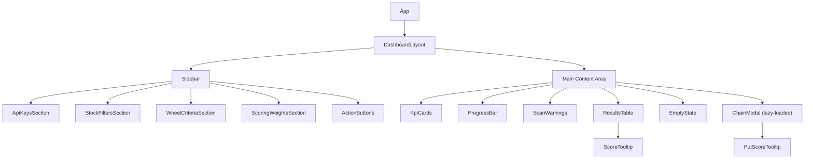
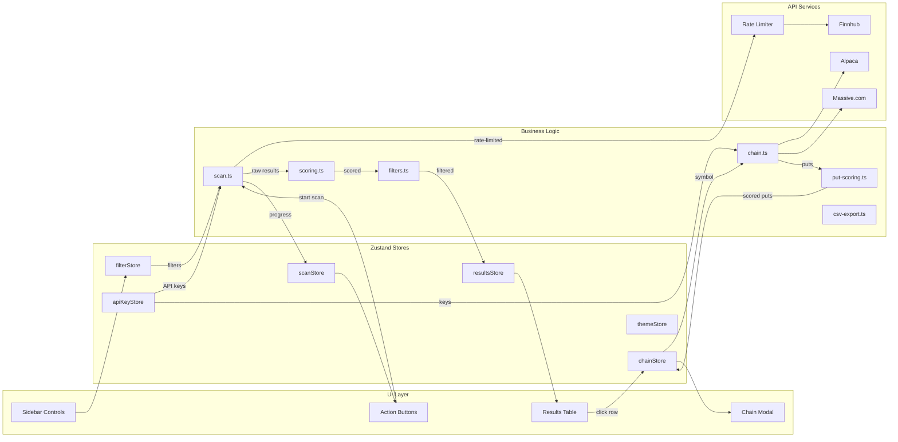
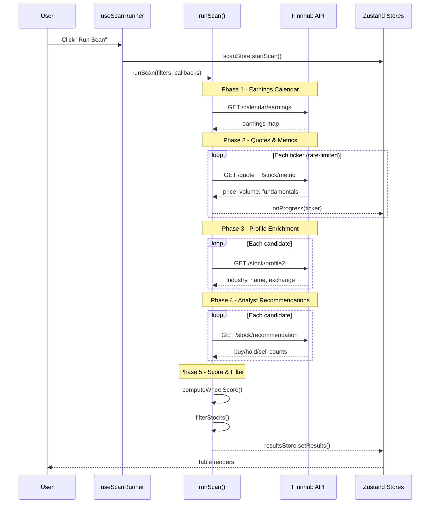
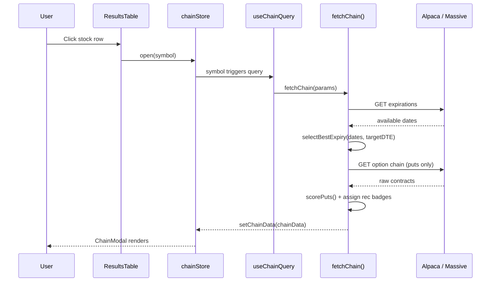
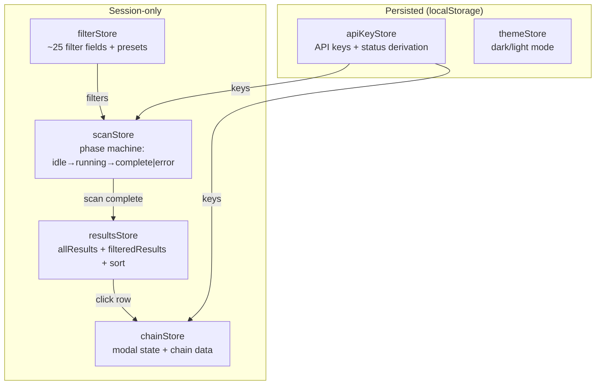
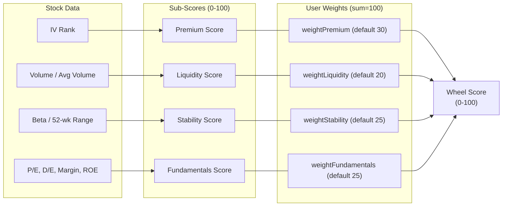

# WheelScan - Options Wheel Strategy Screener

A browser-based stock screener built for the [options wheel strategy](https://www.investopedia.com/articles/active-trading/092815/trading-wheel-strategy.asp). Scans curated ticker lists against Finnhub, Alpaca, and Massive.com APIs, scores each stock for cash-secured put (CSP) suitability using a weighted multi-factor model, and presents results in a sortable dashboard with option chain drill-down.

## Features

- **5-phase scan pipeline** with real-time progress, cancel support, and rate limiting
- **Weighted scoring model** (Premium, Liquidity, Stability, Fundamentals) with adjustable weights
- **3 built-in presets** (Finviz Cut 2, Conservative, Aggressive) plus full custom filtering
- **Option chain modal** with put scoring, recommendation badges, and provider auto-detection
- **12-column sortable results table** with gradient score bars and hover tooltips
- **CSV export** with 24-column output matching production screener format
- **Dark/Light theme** with Financial Terminal Noir design system
- **222 tests** across 12 test files

---

## Architecture

### Component Tree



### Data Flow



### Scan Pipeline



### Option Chain Flow



### Store Architecture



### Scoring Model



---

## Tech Stack

| Layer         | Technology                               |
| ------------- | ---------------------------------------- |
| Framework     | React 19 + TypeScript (strict)           |
| Build         | Vite 7.3                                 |
| Styling       | Tailwind CSS v4 + shadcn/ui              |
| State         | Zustand 5 (6 stores, persist middleware) |
| Data Fetching | TanStack Query v5                        |
| Animation     | Framer Motion                            |
| Testing       | Vitest 4 + Testing Library               |
| Linting       | ESLint 9 + Prettier                      |
| APIs          | Finnhub, Alpaca, Massive.com (Polygon)   |

---

## Getting Started

### Prerequisites

- Node.js 18+
- API keys:
  - **Finnhub** (required) - [Free key](https://finnhub.io/)
  - **Alpaca** (optional, for option chains) - [Paper trading key](https://alpaca.markets/)
  - **Massive.com** (optional, alternative chain provider) - [Free key](https://massive.com/)

### Install & Run

```bash
# Install dependencies
npm install

# Start dev server
npm run dev

# Run tests
npm test

# Production build
npm run build && npm run preview
```

### Configuration

1. Open the app in your browser (default: `http://localhost:5173`)
2. Expand "API Keys" in the sidebar
3. Enter your Finnhub API key (required for scanning)
4. Optionally enter Alpaca or Massive.com keys for option chain data
5. Select a filter preset or customize filters
6. Click "Run Scan"

---

## Project Structure

```
src/
├── components/
│   ├── layout/          # DashboardLayout, Header, Sidebar, ThemeToggle
│   ├── main/            # ResultsTable, ChainModal, KpiCards, ProgressBar
│   ├── sidebar/         # Filter controls, API key inputs, weight sliders
│   └── ui/              # shadcn/ui primitives (dialog, slider, tooltip, etc.)
├── hooks/
│   ├── use-scan-runner.ts    # Scan orchestration hook (useMutation)
│   └── use-chain-query.ts   # Option chain fetching hook (useQuery)
├── lib/
│   ├── scan.ts              # 5-phase scan pipeline
│   ├── scoring.ts           # Wheel score computation
│   ├── put-scoring.ts       # Put option scoring + rec badges
│   ├── chain.ts             # Chain fetching + expiry selection
│   ├── filters.ts           # Stock filtering logic
│   ├── formatters.ts        # Number/currency/percentage formatters
│   ├── csv-export.ts        # 24-column CSV export
│   ├── constants.ts         # Ticker lists, presets, excluded sectors
│   └── utils.ts             # Shared utilities
├── services/
│   ├── finnhub.ts           # Finnhub API client
│   ├── alpaca.ts            # Alpaca Markets API client
│   ├── massive.ts           # Massive.com (Polygon) API client
│   ├── api-error.ts         # Structured API error class
│   └── rate-limiter.ts      # Token bucket rate limiter
├── stores/
│   ├── filter-store.ts      # Filter state + presets
│   ├── scan-store.ts        # Scan phase machine
│   ├── results-store.ts     # Scan results + sorting
│   ├── chain-store.ts       # Chain modal state
│   ├── api-key-store.ts     # API keys (persisted)
│   └── theme-store.ts       # Dark/light theme (persisted)
├── types/
│   └── index.ts             # Domain types (StockResult, PutOption, FilterState, etc.)
├── App.tsx
├── main.tsx
├── index.css
└── theme.css
```

---

## Filter Presets

The app loads with **Finviz Cut 2** as the default preset. All filter values are fully configurable via the sidebar.

### All Preset Defaults

| Filter                    | Finviz Cut 2 (default) | Conservative  | Aggressive   |
| ------------------------- | ---------------------- | ------------- | ------------ |
| **Price Range**           | $10 - $50              | $20 - $100    | $5 - $200    |
| **Market Cap**            | $2B - $2000B           | $10B - $2000B | $1B - $2000B |
| **Min Volume**            | 2M                     | 5M            | 0.5M         |
| **Max P/E**               | 60                     | 30            | 100          |
| **Max Debt/Equity**       | 1.0                    | 0.5           | 2.0          |
| **Min Net Margin %**      | 0                      | 10            | -50          |
| **Min Sales Growth %**    | 5                      | 0             | -50          |
| **Min ROE %**             | 0                      | 10            | -50          |
| **Min Premium**           | 12                     | 8             | 15           |
| **Max Buying Power**      | $10,000                | $15,000       | $20,000      |
| **Target DTE**            | 30                     | 45            | 30           |
| **Target Delta**          | 0.30                   | 0.20          | 0.35         |
| **IV Rank Range**         | 30 - 80                | 20 - 60       | 30 - 100     |
| **Require Dividends**     | No                     | Yes           | No           |
| **Above 200 SMA**         | Yes                    | Yes           | No           |
| **Exclude Earnings**      | Yes                    | Yes           | Yes          |
| **Require Weeklies**      | No                     | No            | No           |
| **Exclude Risky Sectors** | Yes                    | Yes           | No           |

### Scoring Weights per Preset

| Weight           | Finviz Cut 2 (default) | Conservative | Aggressive |
| ---------------- | ---------------------- | ------------ | ---------- |
| **Premium**      | 30                     | 20           | 40         |
| **Liquidity**    | 20                     | 25           | 20         |
| **Stability**    | 25                     | 30           | 15         |
| **Fundamentals** | 25                     | 25           | 25         |

### Ticker Universes

Ticker universe is set separately from presets. Default is `wheel_popular`.

| Universe                  | Tickers      | Description                                                                                                                                                                                                                                                                                          |
| ------------------------- | ------------ | ---------------------------------------------------------------------------------------------------------------------------------------------------------------------------------------------------------------------------------------------------------------------------------------------------- |
| `wheel_popular` (default) | 50           | Popular wheel strategy stocks: AAPL, MSFT, AMZN, GOOGL, META, NVDA, AMD, TSLA, JPM, BAC, WFC, C, GS, V, MA, DIS, NFLX, PYPL, SQ, INTC, CSCO, QCOM, MU, F, GM, T, VZ, PFE, JNJ, MRK, ABBV, BMY, UNH, CVS, XOM, CVX, COP, OXY, ET, KO, PEP, MCD, WMT, TGT, HD, LOW, NKE, SBUX, PLTR, SOFI              |
| `sp500_top`               | 50           | Top 50 S&P 500 by market cap: AAPL, MSFT, AMZN, NVDA, GOOGL, META, TSLA, BRK.B, LLY, UNH, JPM, V, XOM, AVGO, MA, JNJ, PG, HD, COST, MRK, ABBV, CVX, PEP, KO, ADBE, WMT, CRM, BAC, MCD, CSCO, TMO, ACN, ABT, LIN, ORCL, DHR, NKE, NFLX, AMD, TXN, CMCSA, PM, NEE, LOW, UPS, RTX, HON, INTC, AMGN, IBM |
| `high_dividend`           | 29           | High dividend yield: T, VZ, MO, PM, XOM, CVX, COP, OXY, ET, EPD, KMI, WMB, ABBV, PFE, BMY, JNJ, MRK, KO, PEP, CSCO, IBM, INTC, F, GM, WFC, BAC, USB, KEY, SCHW, MMM                                                                                                                                  |
| `custom`                  | user-defined | User enters comma-separated tickers                                                                                                                                                                                                                                                                  |

### Exclusion Lists (hardcoded)

These are always applied when the corresponding filter toggle is enabled. Not configurable per preset.

**Excluded Industries** (10) - filtered when "Exclude Risky Sectors" is on:

> Biotechnology, Pharmaceuticals, Blank Checks, Shell Companies, Savings Institutions, Thrifts & Mortgage Finance, Oil & Gas Exploration & Production, Oil & Gas Drilling, Mortgage REITs, Mortgage Finance

**Excluded Tickers** (30) - always filtered out:

> GME, AMC, BBBY, BB, WISH, CLOV, SPCE, RIDE, WKHS, SNDL, MARA, RIOT, COIN, MSTR, HUT, BITF, BITO, GBTC, TQQQ, SQQQ, UVXY, SVXY, SPXS, SPXL, LABU, LABD, JNUG, JDST

---

## Testing

```bash
# Run all 222 tests
npm test

# Watch mode
npm run test:watch
```

Test coverage by module:

| Module               | Tests | Coverage                                     |
| -------------------- | :---: | -------------------------------------------- |
| `lib/scoring.ts`     |  18   | Wheel metrics, sub-scores, edge cases        |
| `lib/filters.ts`     |  20+  | All filter types, nulls, boundaries          |
| `lib/put-scoring.ts` |  25+  | Spread tiers, delta zones, rec badges        |
| `lib/chain.ts`       |  30+  | Alpaca/Massive parsing, expiry selection     |
| `lib/csv-export.ts`  |  15+  | Headers, escaping, null handling             |
| `lib/formatters.ts`  |  20+  | Currency, percentages, market cap            |
| `lib/utils.ts`       |  15+  | Ticker parsing, dedup, OCC                   |
| `stores/*`           |  40+  | All 6 stores, state transitions              |
| `services/*`         |  20+  | URL construction, auth, retry, rate limiting |
| `components/*`       |  10+  | Weight redistribution algorithm              |

---

## Design System

**Financial Terminal Noir** - dark-mode-first design inspired by Bloomberg terminals.

- **Fonts:** Space Grotesk (display), General Sans (body), JetBrains Mono (data)
- **Colors:** Emerald `#34d399` primary, cool near-blacks `hsl(220, 14%, 5%)` base
- **Effects:** SVG noise texture overlay, gradient borders, backdrop blur on modals
- **Theming:** oklch color tokens with dark/light mode toggle

---

## License

Private project - not licensed for redistribution.
